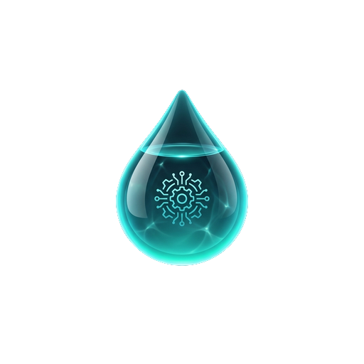
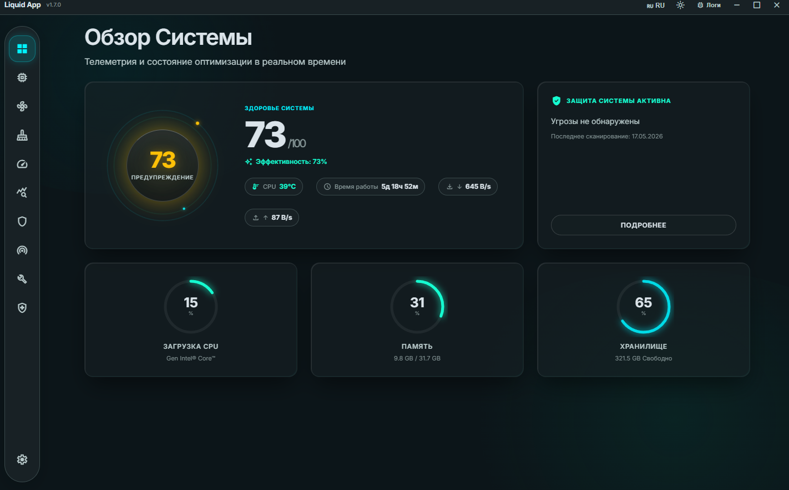

<p align="center">
  
</p>

<h1 align="center">Liquid App</h1>

<p align="center">
  <b>Премиальный системный оптимизатор для Windows 11</b><br>
  <sub>Мониторинг, оптимизация, безопасность — всё в одном</sub>
</p>

<p align="center">
  
  
  
  
  
</p>

---

<p align="center">
  
</p>

---

## О приложении

**Liquid App** — десктопное приложение для комплексного мониторинга, оптимизации и обслуживания Windows 11. Выполнено в стиле Liquid Glass UI с поддержкой тёмной и светлой темы.

Полностью автономное, работает без интернета. Все шрифты и ресурсы встроены локально.

## Возможности

### Мониторинг
- Температура CPU/GPU в реальном времени (Intel, AMD, NVIDIA)
- Загрузка процессора, оперативной памяти и дисков
- Управление вентиляторами (через LibreHardwareMonitor / OpenHardwareMonitor)
- Десктопные виджеты с прозрачным фоном

### Оптимизация
- Умная очистка системы (кэш, временные файлы, корзина)
- Очистка реестра (с автоматическим бэкапом)
- Менеджер автозагрузки (HKCU + HKLM)
- Оптимизация RAM (MinWorkingSet для тяжёлых процессов)
- Игровой режим (Ultimate/High Performance + отключение фоновых процессов)

### Сеть и безопасность
- IP-адрес и геолокация (ip-api.com)
- Тест скорости интернета (Selectel, Hetzner, Tele2)
- Проверка анонимности (VPN/Proxy/Tor детекция)
- WebRTC leak тест
- Сканер приватности (cookies, история, трекеры)

### Обслуживание
- Системные бенчмарки (CPU, RAM, Disk)
- Здоровье системы (SFC, DISM, CHKDSK)
- Бэкап и восстановление реестра
- Точки восстановления системы
- Встроенный логгер с экспортом

### Интерфейс
- Liquid Glass UI с glassmorphism эффектами
- Тёмная и светлая тема
- Русский и английский языки
- Анимации и микро-интерактивность
- Системный трей с быстрым доступом

## Технологии

| Компонент | Технология |
|-----------|-----------|
| Фреймворк | Electron 36 + electron-vite |
| UI | React 19 + TypeScript |
| Стилизация | Vanilla CSS (Liquid Glass Design System) |
| Мониторинг | systeminformation + nvidia-smi + WMI |
| Локализация | i18next |
| Состояние | Zustand |
| Графики | Recharts |
| Сборка | electron-builder (portable + NSIS) |

## Установка

### Портативная версия (рекомендуется)
Скачайте `LiquidApp-1.7.0-portable.exe` из [Releases](../../releases) и запустите. Установка не требуется.

> Приложение запрашивает права администратора (UAC) для доступа к реестру, управлению службами и мониторингу оборудования.

### Сборка из исходников

```bash
# Клонируйте репозиторий
git clone https://github.com/dmitrymx/liquid-app.git
cd liquid-app

# Установите зависимости
npm install

# Запуск в режиме разработки
npm run dev

# Сборка портативного exe
npm run dist:portable
```

## Структура проекта

```
liquid-app/
  src/
    main/           # Electron main process
      index.ts      # Точка входа, IPC, окно, трей
      hardware.ts   # Мониторинг оборудования (persistent PS)
      network.ts    # IP, Speed Test, Anonymity
      cleaner.ts    # Очистка системы и реестра
      benchmark.ts  # CPU/RAM/Disk бенчмарки
      gamemode.ts   # Игровой режим
      backup.ts     # Бэкап/восстановление реестра
      privacy.ts    # Сканер приватности
      startup.ts    # Менеджер автозагрузки
      logger.ts     # Логгер с ring buffer
      widget.ts     # Десктопные виджеты
      utils.ts      # Системная информация
    renderer/       # React UI
      pages/        # Страницы приложения
      components/   # Переиспользуемые компоненты
      styles/       # CSS (Design System)
      i18n/         # Локализация (ru/en)
    preload/        # Context Bridge API
  resources/        # Иконки, бинарники
```

## Автор

**Максимов Д.А.**
- Telegram: [@dmitrymx](https://t.me/dmitrymx)
- Сайт: [mxmvdev.ru](https://mxmvdev.ru)

## Лицензия

MIT License. Copyright 2026 Максимов Д.А.
